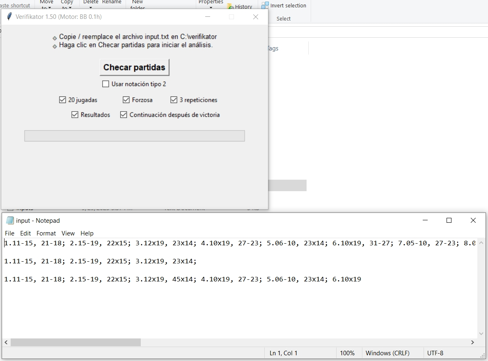

# Verifikator
## SPANISH CHECKERS GAME VERIFIER — PROGRAM OVERVIEW

This program verifies the legality of Spanish Checkers (Damas Españolas) games.  
It can analyze large collections of matches taken from databases or from engines such as Profound, Triturator, Aurora, and others.  
You can paste full game records into the tool, and it checks whether every move follows the official rules.

It was originally designed to validate the rule implementation of the BB‑Zero engine.

The program also performs combinatorial analysis to determine the maximum number of pieces a king can capture, exploring every possible capture path.  
Additionally, it tests closed‑loop captures where a king returns to its origin, ensuring correct handling of multi‑capture sequences and advanced triangulations — the most complex mechanics in Spanish Checkers.

Below is an image of the graphical interface and an example of the output it produces.  
Currently the program is available only in Spanish; an English version is planned for the future.

Once BB‑Zero’s training is complete, this tool will be released for free so Spanish Checkers programmers can use it as a verification and analysis resource.

