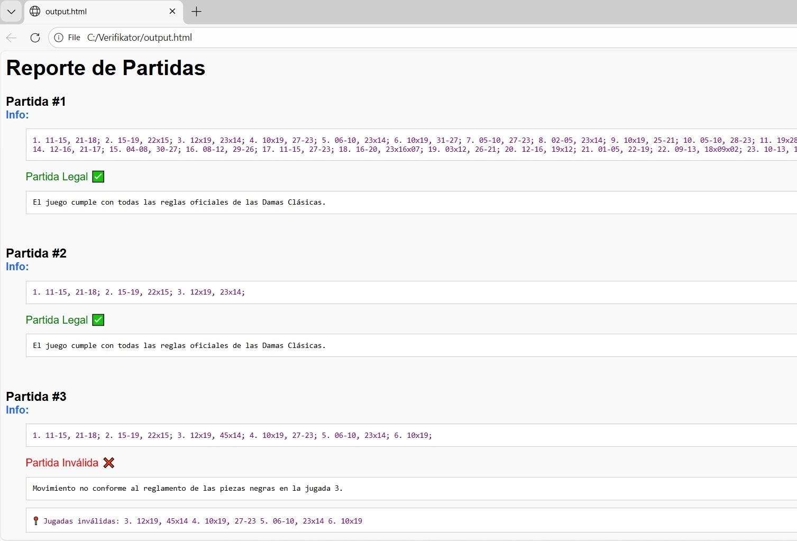

# Verifikator
## SPANISH CHECKERS GAME VERIFIER — PROGRAM OVERVIEW
## VERIFICADOR DE PARTIDAS DE DAMAS ESPAÑOLAS — DESCRIPCIÓN GENERAL

This program verifies the legality of Spanish Checkers games.
It can analyze large collections of matches taken from databases or from engines such as Profound, Triturator, Aurora, and others.
You can paste full game records into the tool, and it checks whether every move follows the official rules.

It was originally designed to validate the rule implementation of the BB‑Zero engine.

The program also performs combinatorial analysis to determine the maximum number of pieces a king can capture, exploring every possible capture path.
Additionally, it tests closed‑loop captures where a king returns to its origin, ensuring correct handling of multi‑capture sequences and advanced triangulations — the most complex mechanics in Spanish Checkers.

Below is an image of the graphical interface and an example of the output it produces.
Currently the program is available only in Spanish; an English version is planned for the future.

Once BB‑Zero’s training is complete, this tool will be released for free so Spanish Checkers programmers can use it as a verification and analysis resource.

## SPANISH TRANSLATION

Este programa verifica la legalidad de partidas de Damas Españolas.
Puede analizar grandes colecciones de partidas tomadas de bases de datos o de motores como Profound, Triturator, Aurora y otros.
Puedes pegar partidas completas en la herramienta, y revisa que cada movimiento siga las reglas oficiales.

Fue diseñado originalmente para validar la implementación de reglas del motor BB‑Zero.

El programa también realiza análisis combinatorio para determinar el máximo número de piezas que una dama puede capturar, explorando todas las rutas posibles.
Además, prueba capturas cerradas donde la dama regresa a su origen, asegurando el manejo correcto de secuencias de múltiples capturas y triangulaciones avanzadas — lo más complejo del juego.

A continuación se muestra una imagen de la interfaz gráfica y un ejemplo del resultado que produce.
Actualmente el programa está disponible solo en español; una versión en inglés está planeada para el futuro.

Una vez que el entrenamiento de BB‑Zero esté completo, esta herramienta será publicada gratuitamente para que los programadores de Damas Españolas puedan usarla como recurso de verificación y análisis.

## Verifikator Output 

